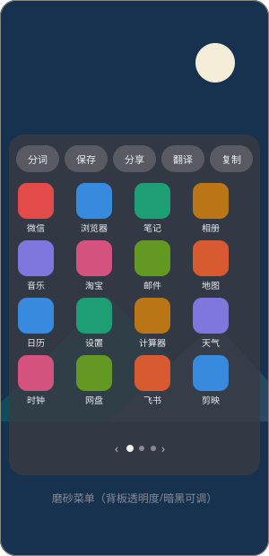
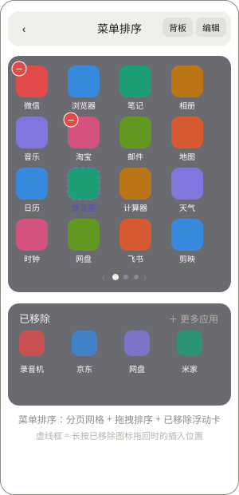
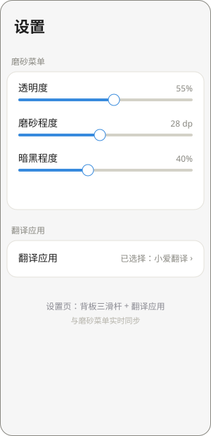

# HyperDragShare

HyperDragShare 是一个 Android LSPosed 模块，为 HyperOS 传送门的文字和图片长按提供同一手势内的分享菜单。

<p align="center">
  
  
  
</p>
<p align="center"><sub>磨砂菜单（背板可调）· 菜单排序页（分页 + 拖拽排序 + 已移除拖回）· 设置（背板三滑杆 + 翻译应用）</sub></p>

## 功能

- 使用 Root evdev 输入，在传送门识别长按后继续跟随当前手指：**长按 → 环形填充 → 点环弹出磨砂菜单**。
- 磨砂菜单背板支持**透明度 / 磨砂程度 / 暗黑程度**三挡滑杆实时调节，排序页与菜单共用同一套设置。
- 支持文字分享、图片分享、保存图片到本地、文本分词，以及**自定义翻译应用**（菜单一键跳转）。
- **菜单排序页**：分页网格管理分享目标——图标 / 长条两种显示、编辑态长按拖动排序、
  左上角 − 移除（自动补位）、下方「已移除」浮动卡点击加回或长按拖回插入排序；
  长条模式下点整行即可复制应用包名。
- 可选无障碍内容获取模式；该模式仍需要 Root 输入，且不会扩大 LSPosed 作用域。
- 支持可关闭的系统日志或 root 保护的诊断文件导出；调试模式会记录输入节点与运行环境信息。

## 要求

- Android 13 或更高版本。
- 已安装并启用 LSPosed；模块作用域仅选择 `com.miui.contentextension`。
- Root 权限用于读取 Linux evdev，从而可靠地跟随同一次拖拽。
- 已验证传送门版本：`4.2.1`。

## 安装

1. 从 [Releases](https://github.com/idealism101/HyperDragShare/releases) 下载 APK 并安装。
2. 在 LSPosed 中启用 HyperDragShare，作用域只勾选传送门。
3. 重新启动传送门作用域进程后，打开 HyperDragShare 完成设置。

不要将 `com.miui.contentcatcher` 加入 LSPosed 作用域，也不要强行停止它。

## 构建

项目使用 Java/Kotlin 17。Windows 下执行：

```powershell
.\gradlew.bat testDebugUnitTest lintDebug assembleDebug
```

生成的 APK 位于 `app/build/outputs/apk/debug/app-debug.apk`。

## 发布

向 GitHub 推送形如 `v1.7.12` 的 tag 后，GitHub Actions 会执行测试、Lint，并通过 R8 构建已签名的 Release APK，随后自动创建对应的 GitHub Release 与 APK 附件。

## 许可证

HyperDragShare 以 [GNU General Public License v3.0](LICENSE)（`GPL-3.0-only`）发布。第三方组件的许可详见应用内“开放源代码许可”页面和 `app/src/main/cpp/NOTICE`。

## 说明

实现边界、输入源仲裁和兼容性约束记录在 [docs/IMPLEMENTATION.md](docs/IMPLEMENTATION.md)。
